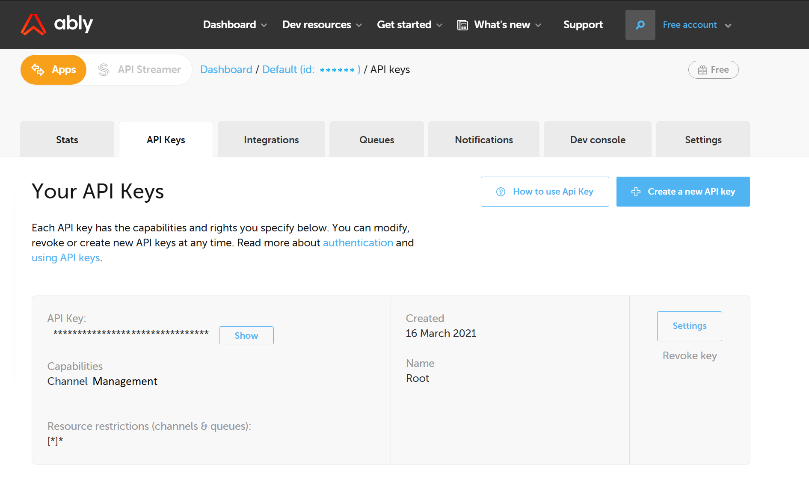
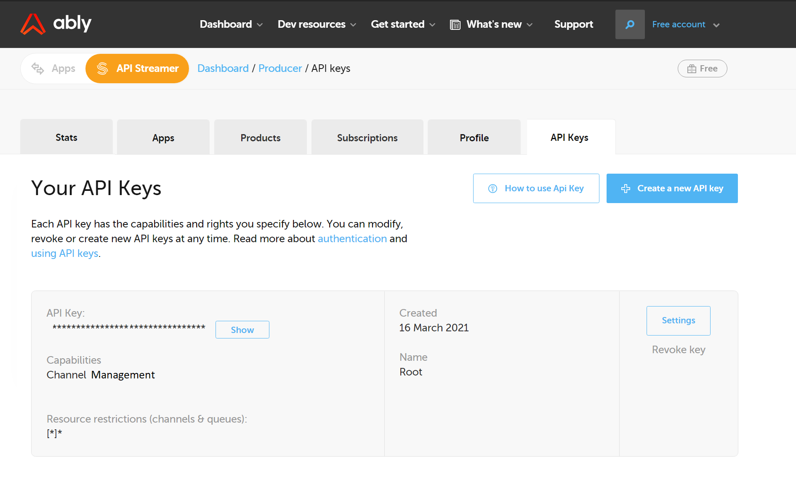
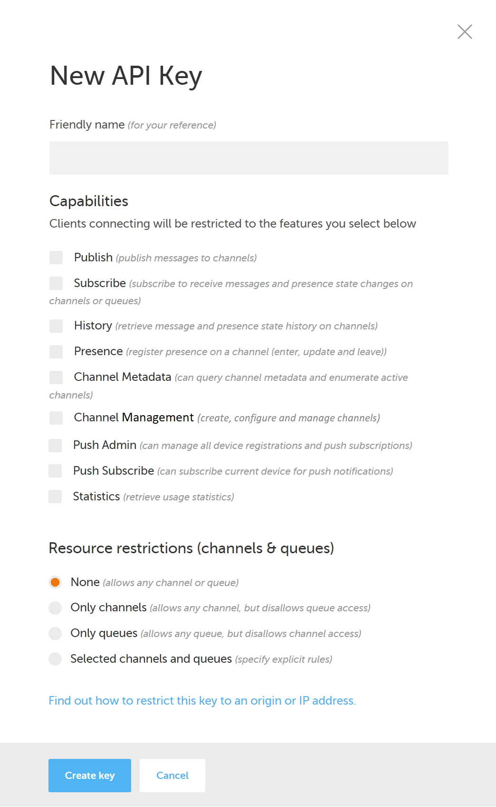
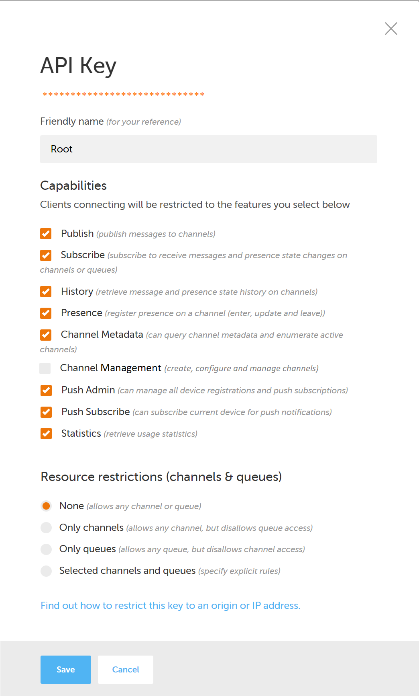

# Channel Management API

## Problem Definition

### Target Customers

Developers using the Ably Realtime platform to provision and manage real-time infrastructure.

### Underserved Needs

Mechanism to automatically create, configure and manage channels.

# Feature Design

Basic channel management API design:

## 1. Authentication Solution

Users are likely to want multiple authentication mechanisms for this API, the following options should be provided, though these can be delivered incrementally:

- API key. Simple option, though less secure than alternatives. Hypothesis that in early days of development this simplicity would be preferable to developers. Consideration should be given to how long lived these tokens should be. Users are likely to want to configure these durations.
- OAuth 2.0. Recommended option, considerably more complex to implement but short-lived nature of authentication significantly increases security. Hypothesis that this would be the customer preference for production usage.

These hypotheses should be validated through early user engagement.

Options will be required for to set the scope for each authentication solution appropriately. The following scope options should be available for users to set when determining their authentication solution:

1. Application level. This would require configuration for each App.
2. Account level. This would provide access to all Apps within the Account.
3. User level. This would provide users with access to all Apps in every Accounts that the user has access to.

The first of these is most limited and therefore most secure option (of more relevance to API keys).

## 2. Authentication Management

Basic mock ups are provided below for the Application level and User level API Key management. These extend the existing API Key management from Ably dashboards:

### Application level API key management

### User level API key management

### Creating new API keys

### Updating existing API keys

Further work would be needed to add the ability to customise the expiry date of the API keys, both when creating and updating a key.

## 3. Supporting Customer Adoption

Customer adoption of the new Channel Management API can be supported through both:

- Incorporation into existing libraries & SDKs.
- Provision of documentation, tooling and associated configuration.

### Updated Libraries & SDKs

The Ably REST client library and Realtime SDKs to be updated to include the Channel Management API. 

This should focus on highest usage libraries and SDKs, incrementally adding integration with the Channel Management API in each.

Prioritisation of these updates should incorporate data driven feedback on where the Channel Management API will add most value. Starting with the hypothesis that the REST client libraries are more likely to be used as the entry point to the Channel Management API than the Realtime SDKs. This should be validated with existing customers through interviews and a wider audience through surveys. The data from these surveys can then be used to inform the priority of the libraries to update.

### Documentation & Tooling

Public facing [documentation sites](https://ably.com/documentation/) to be updated with:

- Overview guidance for the Channel Management API.
- Authentication guidance (and options where alternatives exist).
- Features, endpoints and parameters currently provided.
- Interactive API documentation using [Swagger](https://swagger.io/about/) (or equivalents).
- Recommend API client for testing (e.g. [Postman](https://www.postman.com/)) and provide pre-populated collection templates for customers to test against.

## 4. Feature Scoping

High level approach to feature scoping:

- Request expression of interest in new feature (identifying a canary audience).
- Use this group to gather:
    - Qualitative feedback on problems faced and feature suggestions through interviews.
    - Quantitative feedback through user surveys.
- Form hypothesis of smallest valuable version of the feature. This needs to be a thin slice through the application, that includes:
    - `GET /channel` 
    - `GET /channel/{channelId}`
    - `PUT /channel/{channelId}`
    - The minimum authentication mechanism (e.g. adding a new scope option for Application level API keys).
- Validate this hypothesis with the canary audience. At this point, development can commence whilst the full scope is fleshed out. It is important to get feedback early - rather than defining the complete feature to minimise rework in case the early hypotheses were invalid.
- Form prioritised list of requirements for the feature that account for:
    - Technical requirements.
    - Complete user journeys.
    - User suggestions & feedback.
- Plan increments of the feature that implement these requirements.

### Prioritisation

Beyond the initial (validated) thin slice of the Channel Management API feature, subsequent iterations should be prioritised according to:

- Value delivered by increment.
- Investment to deliver by increment.
- Return on investment (i.e. maximum value delivered for investment).

This can be done scientifically (see Dan Olsen's Lean Product Playbook) but does not have to be. The idea is that we can demonstrate that we are delivering value quickly.

## 5. Feature Launch

Feature launch to be phased as follows:

### Dogfooding

During development of the Channel Management API, this should be exposed internally to Ably development and operations teams. This will enable rapid feedback on the API as endpoints are completed and implemented, alongside incremental addition of new parameters.

The objective of this phase of launch is to ensure that the software has been subjected to "real-world" testing in addition to the controlled testing conducted as part of the development process.

Once confident that the initial version of the API adds value to the development community, it should be opened up to real world customers in the form of a canary release. It should be noted that this process will repeat for each incremental release of the API.

### Canary

The initial candidate release for the API should be exposed to a sub-set of customers, who have expressed an interest in the feature and accepted that it may be rough around the edges. This should be determined through a metadata flag in their accounts.

Users in the canary test should be provided with access to the new API functionality and documentation (via a feature flag). These users should be given an easy way to provide feedback on their use of the API, likely through existing support channels.

In addition to direct (qualitative) feedback from these users, usage should be monitored to provide quantitative feedback. If desired, this subset of users could also be split via A/B testing to validate hypotheses made during design and implementation of the API. This data driven decision making will likely improve the quality of the product ahead of general availability launch.

### General Availability

The final phase of the launch should be the general availability release, opening up the feature to all users. In this phase, further A/B testing can be undertaken to refine the product and use higher user volumes to generate more statistically significant feedback.

In addition to the phases defined here, the release should follow an incremental pattern, releasing functionality that adds value as soon as possible, in order to gather feedback and iterate accordingly. It would be expected that all three phases could run concurrently on differing versions of the API (for example with difference endpoints implemented).

### Success Criteria

The success of the API and launch should be measured through the following KPIs, and their impact on Ably's wider OKRs:

#### Direct KPIs

- API Interest. Number of customers who have expressed interest in participating in Canary testing.
- Canary & GA Adoption. For customers on the Canary and GA releases, measure the number using the API. Expect this to be higher for Canary users (who have expressed an explicit interest).
- Canary Feedback. Track direct feedback from customers using canary release versions - could be segmented based on sentiment analysis.
- API Usage. Number of calls made to the Channel Management  API on a daily basis.

#### Indirect OKRs

- Subscriptions / subscription rate. Track the number of customers / rate of customer sign-up following the release of this feature.
- Upgrade / upgrade rate. Track the number of customers upgrading their subscription / rate of subscription upgrades following the release of this feature.
- Revenue impact. Increase of revenue associated with the above new subscriptions and subscription upgrades.

## 6. Further Considerations

### Competitor Analysis

This document has been prepared without significant competitor analysis. Understanding the offerings of competitors (e.g. Pusher, PubNub, AWS IOT) would better inform the value proposition and therefore the feature design, customer expectations and objectives for customer adoption.

### Declarative Infrastructure Provisioning

The true benefit of an API (over webservice ClickOps) is that it enables developers to consistently, reproducibly and reliably conduct operations on the Ably Platform. This eliminates user error and allows teams to scale their applications and deployments, as well as produce scripts that can be used to automate responses to incidents that occur.

Taking this to it's logical conclusion, offering a declarative mechanism by which state can be determined allows customers to provide declarative infrastructure. Producing (and open sourcing) a Terraform provider to interact with the Channel Management API (and other existing Ably Realtime APIs) would enable customers to build Ably into their Infrastructure as Code stacks.

### Soft Limits

The downside of APIs is that they are easy to abuse, usually unintentionally. To this end, it is probably worth setting soft limits for creation of channels via the Channel Management API. This will prevent errant automated scripts from provisioning untold numbers of channels - effectively exposing the API to a DDoS attack. 

Imposing a soft limit is a common mechanism in which this risk can be mitigated. Customers with genuine need to increase these limits can do so through simple interaction with Customer Success / Support teams. This has the added benefit of a direct conversation with customers to delight them and elicit feedback that may not be possible in more transactional relationships.

# Future of Ably Realtime

Ably's future has exponential potential. The markets in which it operates are growing at an unfathomable rate, and the need for real-time communication is only going to increase. 

Forecasting a vison for Ably that is initially limited to existing offerings and current value proposition:

- Demand will scale dramatically, seeing Ably provide a truly global messaging PaaS that is used in the every day lives of billions of people.
- Ably will be synonymous within the developer community for real-time libraries, with customer and partners building the SDK directly into their services.
- The PaaS will be polycloud, with best in class anywhere to anywhere latency.
- This will require global privacy, data sovereignty and data protection regulations be considered, alongside broader ethical and political considerations.

Thinking more broadly, new services will be added to the platform that enable customers to leverage Ably's key pillars of dependability to analyse and enrich their inflight real-time communications:

- Run data driven models on messages flowing through the PaaS in real-time. Offer customers the ability to test and deploy custom machine learing models on the PaaS.
- Conduct content and sentiment analysis on real-time messaging, blocking those that contravene usage policies (and regional laws).
- Automatically respond to messages, enabling remote monitoring and control of IOT devices and fleets of autonomous vehicles.
- Dynamically account for failures and faults in integrated services to "optimise everything, in real-time".